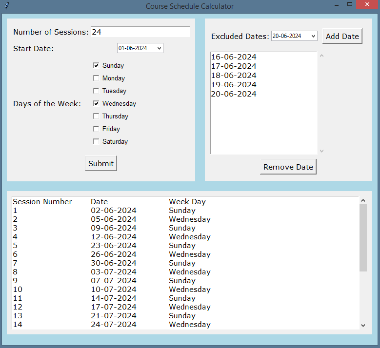

# TermSessionsDates

TermSessionsDates is a Python-based application to calculate the schedule of sessions for a course. The application allows you to specify the number of sessions, the start date, and the days of the week when sessions should occur. You can also specify dates to exclude from the schedule.

## Features

- Calculate course schedule based on the number of sessions and start date
- Select specific days of the week for sessions
- Exclude specific dates from the schedule
- Display the resulting schedule in a readable format
- Save and load excluded dates from a JSON file

## Requirements

- Python 3.x
- tkcalendar==1.6.1

## Installation

1. Clone the repository:
    ```bash
    git clone https://github.com/mofasuhu/TermSessionsDates.git
    cd TermSessionsDates
    ```

2. Create a virtual environment and activate it:
    ```bash
    python -m venv venv
    source venv/bin/activate  # On Windows: venv\Scripts\activate
    ```

3. Install the required dependencies:
    ```bash
    pip install -r requirements.txt
    ```

## Usage

### For Developers

Run the application using the following command:
```bash
python TermSessionsDates.py
```

### For Non-Developers

Use the executable file located in the `TermSessionsDates` folder. Double-click `TermSessionsDates.exe` to run the application.

## Screenshot



## Project Structure

```
TermSessionsDates/
├── .gitignore
├── LICENSE
├── README.md
├── requirements.txt
├── myscreenshot.png
├── TermSessionsDates.py
└── TermSessionsDates/
    ├── TermSessionsDates.exe
    └── _internal/
```

## Explanation of Files

- **.gitignore**: Specifies files and directories to be ignored by git.
- **LICENSE**: Contains the license information for the project.
- **README.md**: This file, containing information about the project.
- **requirements.txt**: Contains the list of dependencies needed for the project.
- **screenshot.png**: Screenshot of the GUI.
- **TermSessionsDates.py**: The main Python script for the application.
- **TermSessionsDates/**: Contains the executable file and internal resources.

## Example

1. Enter the number of sessions.
2. Select the start date.
3. Choose the days of the week when the sessions should occur.
4. Optionally, add any dates to exclude from the schedule.
5. Click "Submit" to generate the schedule.

## Contributing

Contributions are welcome! Please open an issue or submit a pull request for any improvements or bug fixes.

## License

This project is licensed under the MIT License - see the [LICENSE](LICENSE) file for details.

